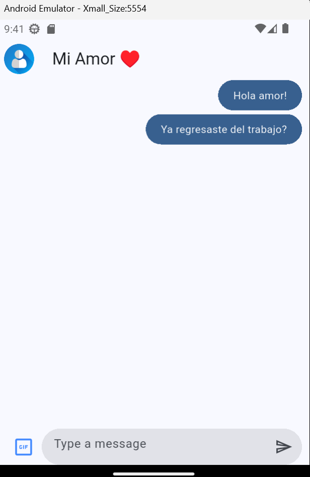

# Yes No App

An interactive Flutter application where you can chat with two different personalities:

### 🤖 Chat Modes
- **Yes or No**: Ask a question (ending with `?`) and get a random animated GIF response via the Yes/No API.
- **Jokes**: Engage in a funny conversation with a joke setup and punchline flow.

### ✨ Features
- **Interactive Chat UI**: Beautifully styled chat bubbles with distinct colors for user and responses.
- **GIF Support**: Send and receive animated GIFs.
- **Dual Chat Modes**: Switch between different chat experiences seamlessly.
- **Environment Config**: Uses `.env` for managing API endpoints.

### 🛠️ Tech Stack
- **Flutter**: Cross-platform UI framework.
- **Dio**: Powerful HTTP client for API requests.
- **Provider**: State management.
- **Flutter Dotenv**: Environment variable management.

<p align="center">
  
</p>


## Getting Started

### Prerequisites

Before you begin, ensure you have the [Flutter SDK](https://docs.flutter.dev/get-started/install) installed on your machine.

### Installation

1. Clone the repository:
   ```bash
   git clone https://github.com/Angstromico/Flutter-Yes-No-App.git
   cd Flutter-Yes-No-App
   ```

2. Create a `.env` file in the root directory and add the following:
   ```env
   YES_NO_API_URL=https://yesno.wtf/api
   JOKE_API_URL=https://official-joke-api.appspot.com/random_joke
   ```

3. Install dependencies:
   ```bash
   flutter pub get
   ```

## Running the App

You can run the app on various platforms. Make sure you have the appropriate emulator or physical device connected.

### Mobile (Android & iOS)
- Connect your device or start an emulator.
- Run the following command:
  ```bash
  flutter run
  ```
  *(If multiple devices are connected, use `flutter run -d <device_id>`)*

### Web
- Run the app in Chrome:
  ```bash
  flutter run -d chrome
  ```

### Desktop
Ensure desktop support is enabled for your OS:
- **Linux**: `flutter config --enable-linux-desktop`
- **macOS**: `flutter config --enable-macos-desktop`
- **Windows**: `flutter config --enable-windows-desktop`

Then run:
  ```bash
  flutter run -d linux # or macos / windows
  ```

## Project Structure
- `lib/`: Contains the application source code.
- `lib/presentation/`: UI screens and components.
- `lib/infrastructure/`: Data sources and models.
- `lib/domain/`: Business logic and entities.
- `assets/`: Images and other static resources.

## Resources
- [Flutter Documentation](https://docs.flutter.dev/)
- [Flutter Learning Resources](https://docs.flutter.dev/reference/learning-resources)
